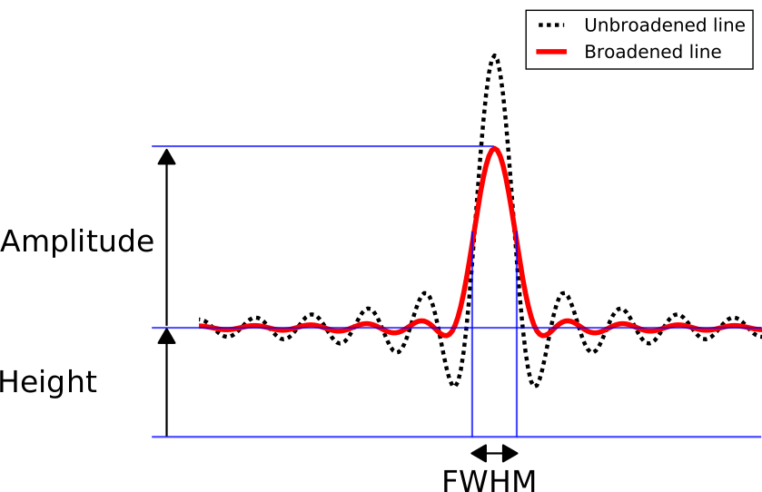

Introduction
============

.. contents::
   
A few words on ORCS
-------------------

ORCS is a Python module which gives you the keys to the analysis of
your SITELLE data cube.

It is composed of calibration methods, extracting tools and a powerful
fitting engine specifically designed for interferometric data. When
fitting spectra, both a classical (frequentist) and a Bayesian
paradigm are available.

The fitting engine
------------------

Models
~~~~~~

ORCS ftting engine has been built to accept any number of models (even
grid models). Up to now only three models are available (and used by
default). They all are implemented and documented in the orb.fit
module:

- :py:class:`orb.fit.Cm1LinesModel`: Emission/absorption
  lines (sinc convoluted with a Gaussian giving a certain broadening
  to the sinc)

  
- :py:class:`orb.fit.ContinuumModel`: Continuum emission (treated as a
  polynomial)
    
- :py:class:`orb.fit.FilterModel`: Filter

Models parameters
~~~~~~~~~~~~~~~~~
  
Emission lines and background model parameters are always defined via
keywords which are passed to the fitting functions (see
:ref:`examples`).

Each model is based on a given number of core parameters. In the case
of the lines model those parameters are, for each line, its amplitude
(``amp``), FWHM (``fwhm``), position (i.e. its wavenumber of
wavelength, ``pos``) and its broadening (``sigma``, only in the case
of a ``sincgauss`` line shape - this parameter does not apply for pure
``gaussian`` or ``sinc`` line shape).

In the worst case all the core parameters are free. But you can also
decide to fix some of them or make them covarying. By default all the
parameters are free but you can change the definition of each
parameter with the keywords: ``amp_def``, ``pos_def``, ``fwhm_def``
and ``sigma_def``. If the FWHM is fixed then you will pass the option
``fwhm_def='fixed'`` to the fitting method.

Let's start with classical free parameters. Once the behaviour of the
parameters is defined you may want to give it a good initial guess
value (especially for the wavenumber) and start fitting. The initial
guess value can be given with the keywords : ``amp_guess``,
``pos_guess``, ``fwhm_guess`` and ``sigma_guess``. Only the guess on
the wavenumber is necessary as the others have no real impact on the
result or, in the case of the fwhm, they are known a priori with a
good enough precision. The guess on the wavenumber is so important
that it is not an optional keyword and can be specified with the
``lines`` parameter of the fitting method.

The notion of covariation is a little more complex but is certainly
the most useful. Two or more lines can share the same broadening. In
this case the broadening parameter of both lines must be replaced with
one single parameter. You can define the covarying parameter by
tagging them with the same symbol (a string or a number). let's say
you have three lines (line0, line1, line2), you can group the
broadening of line0 and line2 by passing to the fitting function the
keyword ``sigma_def=('1','2','1')``. The real broadening of the lines
used to model the spectrum will be a function of the initial guess
value of the broadening of both lines (0 km/s by default) which will
be fixed during the fit and the covarying value which is a free
parameter.

In general the final value of a covarying line parameter is defined
as: :math:`val = f(guess, cov)`. `val` is the final value (e.g. the
observed wavenumber), `guess` is the fixed guess_value (e.g. rest
wavenumber of the line), `cov` is the value of the covarying parameter
(e.g. velocity in km/s), `f` is the covariation operation (in the case
of the line wavenumber the Doppler shift equation).

You can also group the lines with the same velocity. In this case, the
base parameter is the wavenumber of the lines and the covarying
parameter is a velocity. To group the lines having the same velocity
(e.g. line0 and line1 in the example) you must pass the keyword
``pos_def=('1','1','2')``. The real wavenumber of the lines used to
model the spectrum will be a function of the lines rest-frame
wavenumber (fixed and passed as an initial guess parameter) and their
group velocity. The velocity may be substantially different from 0 and
the value of the covarying parameter must thus be given to compute a
good enough first initial wavenumber of the lines. The value of the
covarying parameter can be passed with the keywords: ``amp_cov``,
``pos_cov``, ``fwhm_cov`` and ``sigma_cov``. If we want to set an
initial velocity of 1500 km/s to the first group of lines and an
initial velocity of 3000 km/s to the second group of lines (which
contains only ``line2``) we must give one velocity per group of
velocities in the order of their appearance in the definition
(here ``pos_def=('1','1','2')``), i.e. ``pos_cov=(1500, 3000)``

These examples are related to the definition of the fitting parameters:

- :ref:`fit_a_single_spectrum.ipynb`

- :ref:`velocity_parameter_precision.ipynb`

- :ref:`constaining_line_ratios.ipynb`

.. image:: images/sky-spectrum.png
   :width: 100%
   :align: center

List of the fitting parameters
~~~~~~~~~~~~~~~~~~~~~~~~~~~~~~

general
*******

:fmodel: emission line model (can be 'sinc', 'sincgauss',
         'gaussian'). 'gaussian' model should not be used unless for
         testing purposes. Even for very large gaussian, a sincgauss
         model is preferred.
	 
:no_filter: Set it to False if the filter transmission is visible in
            the spectrum (i.e. if there is enough continuum to see
            it). False by default. *Must be set to True if the
            spectrum has been corrected for the background and does
            display only emission lines*. As the precise wavelength
            shift of the filter in the FOV is still unknown it is a
            free parameter which can prove unstable when its position
            cannot be well constrained from the data.

:subtract_spectrum: Spectrum to subtract. Must be a 1d numpy.ndarray
                    of the same size as the spectrum to fit. It should
                    be scaled to the flux contained in only one pixel.
		    (e.g. if it has been extracted from a large region).
		    
:poly_order: Order of the polynomial used to fit the background (be careful 
             with high order polynomials). Default to 0.
	     
:signal_range: Range of the signal over which the fit is done (helps removing
               strong sky lines from the fit)
	 

.. note:: when extracting a background spectrum, its flux can be
          scaled to one pixel with `mean_flux=True`. A median can also
          be used to combine the integrated pixels with
          `median=True`. If `mean_flux=False`, even if `median=True`,
          the flux will be scaled to the number of integrated pixels.

.. code-block:: python

   axis, sky = cube.extract_spectrum(500, 500, 30, median=True, mean_flux=True)
   axis, spectrum = cube.extract_spectrum(1542, 1436, 3, subtract_spectrum=sky)
		    
position
********

:pos_def: Definition of the position (i.e. wavenumber) parameter of
          each line e.g. may be 'free', 'fixed' or a group key
          (e.g. '1', 'a' etc.), set to 'free' by default
  
:pos_cov: velocity guess of the grouped lines in km/s. the covariation
          operation is Doppler shifting.

:pos_guess: **Cannot be passed**, replaced by the parameter ``lines``
            in the fitting function.

amplitude
*********
  
:amp_def: Definition of the amplitude parameter of each line e.g. may
          be 'free', 'fixed' or a group key (e.g. '1', 'a' etc.), set
          to 'free' by default
  
:amp_guess: Initial guess on the amplitude value. Generally not
            set. Used to set a fixed ratio to the lines.
	    
:amp_cov: **does not have to be set** (1 by default). the covariation
  operation is a multiplication.

fwhm
****
  
:fwhm_def: Definition of the amplitude parameter of each line e.g. may
           be 'free', 'fixed' or a group key (e.g. '1', 'a' etc.). Set
           to 'fixed' if fmodel is a `sinc` or a `sincgauss` (i.e. all
           lines share the same fwhm, and its value is known). Else,
           it is set to 'free'.
  
:fwhm_guess: Initial guess on the fwhm value. Set to a computed
             default value in the case of a `sinc` or a `sincgauss`.
	    
:fwhm_cov: Generally let unset. Covariation operation is an addition.

sigma (only for sincgauss)
**************************

This parameters refers to the expansion velocity (in km/s) or more
generally the broadening of the gaussian-shaped line (itself
convoluted with a `sinc` of known fwhm). The broadening is thus by
definition 'corrected' for the `fwhm`.

.. warning:: If the input value of the parameter (set with
       `sigma_guess` or `sigma_cov`) is too small, the fit will not
       converge.

:sigma_def: **must be set** Definition of the sigma parameter of each
            line e.g. may be 'free', 'fixed' or a group key (e.g. '1',
            'a' etc.).

:sigma_guess: Must be set only if its definition is set to free. If
              set, should be not a too small value (e.g. > 30 km/s).
	      
:sigma_cov: **Must be set if lines are grouped**. If set, should be
            not a too small value (e.g. > 30 km/s). Covariation
            operation is a an addition.

  
	   
Uncertainties
~~~~~~~~~~~~~
	   
The uncertainties on the returned parameters are based on the
assumption that noise distribution is Gaussian and that there are not
correlated. I have checked those assumptions by analyzing the
distribution of the posterior probability on each parameter with a
Monte-Carlo-Markov-Chain algorithm and found that they are very
reasonable. The uncertainties returned by the MCMC algorithm are also
very close to the one returned by our algorithm (less than a few
percents).

  
.. _list-lines:
	
List of available lines
-----------------------

An up-to-date list of all the available lines may be found with the following

.. code-block:: python

   import orb.core
   orb.core.Lines.air_lines_nm

	     
============    ================
    NAME         Air Wavelength
============    ================
H15             371.19774
H14             372.19449
[OII]3726       372.7319
[OII]3727       372.7319
[OII]3729       372.9221
H13             373.43746
H12             375.01584
H11             377.06368
H10             379.79044
H9              383.53909
[NeIII]3869     386.876
H8              388.90557
H7              397.00788
Hepsilon        397.00788
Hdelta          410.17415
H6              410.17415
H5              434.0471
Hgamma          434.0471
[OIII]4363      436.3209
Hbeta           486.1333
H4              486.1333
[OIII]4959      495.8911
[OIII]5007      500.6843
HeI5876         587.567
[OI]6300        630.0304
[SIII]6312      631.206
[NII]6548       654.805
H3              656.2819
Halpha          656.2819
[NII]6584       658.345
[NII]6583       658.345
HeI6678         667.81517
[SII]6716       671.644
[SII]6717       671.644
[SII]6731       673.0816
HeI7065         706.52153
[ArIII]7136     713.579
[OII]7320       731.992
[OII]7330       733.019
[ArIII]7751     775.111
============    ================

To get a clean text output of all the available lines:

.. code-block:: python
   
   import orb.core
   lines = orb.core.Lines.air_lines_nm

   slines = list()
   for iline in lines:
       slines.append([iline, lines[iline]])

   slines = sorted(slines, key=lambda a: a[1])
    
   out = ''
   for iline in slines:
       out += '{:15s} {}\n'.format(iline[0], iline[1])
   print out
   
